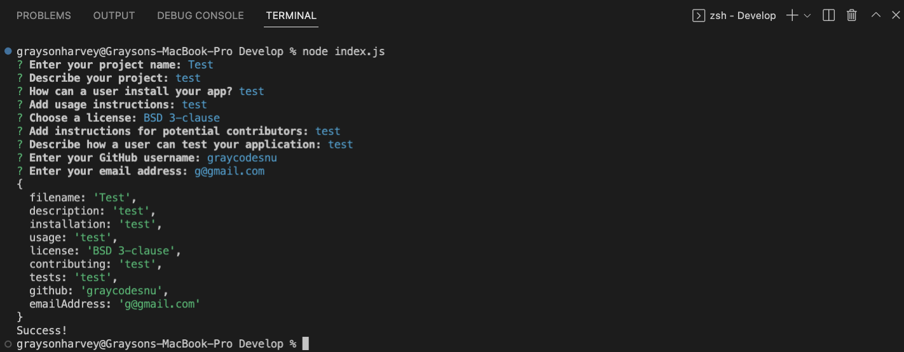

# node-readme

## Introduction
This project is a result of our bootcamp's week 9 homework assignment. Students were expected to create a README.md file generator using Node.js. The project repository can be found [here](https://github.com/graycodesnu/node-readme) and the demo video can be found [here](https://drive.google.com/file/d/1St-Si8Wu9aCa9QI1vvXhKOsWRZptzbra/view).

## Goals 
The goal of this assignment was to create a README.md generator that would meet the below criteria:

+ The user is prompted for information about their application and their inputs are added to the README.md file under their corresponding sections
+ The project title the user inputs will also be the name of the README file
+ When a user chooses a license for their application, a badge for that license is added
+ When a user enters their GitHub username and email address, their information will be added to the Questions section
+ When a user clicks the links in the Table of Contents, they are taken to the corresponding section of the README

## Results 
This project turned out better than I expected it to. A few classmates and I collaborated and helped debug each other's code, which made this project much more fun. I was excited to create something that we could potentially use for future README files. 

One thing I found particularly difficult was the .gitignore file for the node_modules. I tried several different methods to get the .gitignore to work (including creating separate directories and repositories), but was not able to figure it out.

I hope to use this app for my future README files and definitely look forward to collaborating with my classmates on the same level for future assignments!